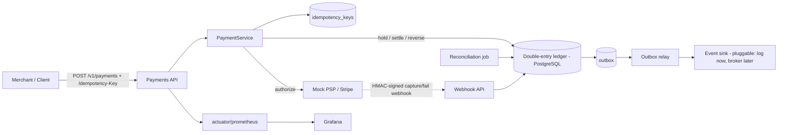

# Apex Payments Engine & Double-Entry Ledger System

[](https://www.python.org/)
[](https://fastapi.tiangolo.com/)
[](https://www.sqlalchemy.org/)
[](https://www.postgresql.org/)
[](https://redis.io/)
[](https://www.docker.com/)
[](https://alembic.sqlalchemy.org/)
[](https://prometheus.io/)
[](https://grafana.com/)

A production-grade payments backend: a **double-entry ledger** as the source of truth, **idempotent** payment APIs, a **hold → settle saga**, **async capture via signed webhooks**, **refunds**, a **transactional outbox** (dual-write-safe) drained by a pluggable relay, a **reconciliation** job, and **Prometheus/Grafana** observability.

---

## Architecture



Money moves between typed accounts (`USER_WALLET`, `MERCHANT_PAYABLE`, `PSP_SUSPENSE`, `FEE_INCOME`). Every transfer is a balanced set of postings (Σ = 0), enforced in code **and** by a deferred Postgres constraint trigger. Balances are a materialized, continuously-reconciled cache.

---

## Run it (no host setup needed — everything builds in Docker)

```bash
docker compose up --build
curl localhost:8080/actuator/health         # {"status":"UP"}
```

| URL | What |
| :--- | :--- |
| `http://localhost:8080` | the API |
| `http://localhost:8080/actuator/prometheus` | metrics |
| `http://localhost:9090` | Prometheus |
| `http://localhost:3000` | Grafana (anonymous admin; Prometheus datasource pre-provisioned) |

**Stop:** `docker compose down -v`.

---

## API

```
POST /v1/payments                  Idempotency-Key: <uuid>   -> 201 | 409 | 422
GET  /v1/payments/{id}
POST /v1/payments/{id}/refunds     Idempotency-Key: <uuid>   -> 201 | 422
POST /v1/webhooks/psp              X-PSP-Signature: <hmac>   -> 200 | 401
POST /v1/webhooks/stripe           Stripe-Signature: <t=..,v1=..> -> 200 | 401
GET  /v1/accounts/{id}/balance
GET  /v1/accounts/{id}/ledger
GET  /v1/reconciliation/report
```

---

## Design highlights

- **Idempotency** — durable `(merchant, key)` claim; concurrent duplicates conflict, completed ones replay. Race-safe via a unique constraint.
- **Double-entry ledger** — immutable postings; balances maintained under `SELECT … FOR UPDATE` with a non-negative guard (no oversell); net-zero enforced by a deferred trigger.
- **Saga** — `hold → authorize → settle | reverse`, with the PSP call outside any DB transaction.
- **Async capture** — `authorize` may return `PENDING`; a signed (`HMAC-SHA256` / `Stripe-Signature`) webhook captures or fails the held payment, idempotent on `psp_event_id` plus a state guard.
- **Transactional outbox** — events written in the same tx as the state change (solves the dual-write problem); a scheduled relay drains them (`FOR UPDATE SKIP LOCKED`) via a pluggable `EventPublisher` (a logging sink now; swap in a broker like Kafka for downstream fan-out).
- **Refunds** — full/partial, idempotent, over-refund guarded.
- **Reconciliation** — asserts `Σdebits = Σcredits` and balance == Σ postings; expires stale holds.

---

## Observability

Prometheus (`/actuator/prometheus`): `payments_created_total{outcome}`, `http_server_requests_seconds` (p95/p99 histograms), and the **`ledger_imbalance`** gauge (must read 0). Grafana is wired to Prometheus out of the box.

---

## Load test

```bash
NET=$(docker network ls --format '{{.Name}}' | grep -i payments | grep -i default | head -1)
docker run --rm --network "$NET" -v "$PWD/load":/scripts:ro \
  -e BASE_URL=http://app:8080 grafana/k6 run /scripts/payments.js
```

**Measured (local, single instance on Rancher Desktop — Docker-in-VM on an Apple-Silicon Mac):**
50s ramping load, 20 VUs → **3,691 payments, 0 failures (100% `201`)**, **73.8 payments/s**, latency **median 214 ms · p95 452 ms · p99 614 ms · max 1.09 s**. Every request does an idempotency claim + a multi-posting double-entry transfer under row locks + an outbox write, so this is end-to-end write throughput, not a read benchmark.

---

## Tests

Run against Postgres:

```bash
pytest tests/ -v
```

---

## Milestones

| M | Scope | Status |
|---|-------|:------:|
| **M0** | Skeleton: Dockerized stack, schema, double-entry trigger | ✅ |
| **M1** | Ledger balance maintenance + 100-parallel oversell test | ✅ |
| **M2** | Payments + idempotency + hold→settle saga | ✅ |
| **M3** | Transactional outbox + scheduled relay (pluggable `EventPublisher`) | ✅ |
| **M4** | Async capture via HMAC-signed webhooks | ✅ |
| **M5** | Refunds + reconciliation | ✅ |
| **M6** | Observability + k6 load test + this README | ✅ |

---

## 📜 License
This project is licensed under the MIT License.
